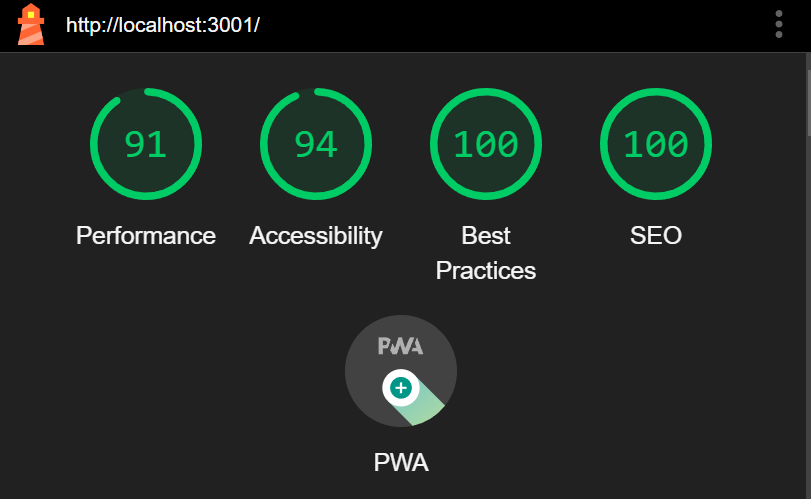
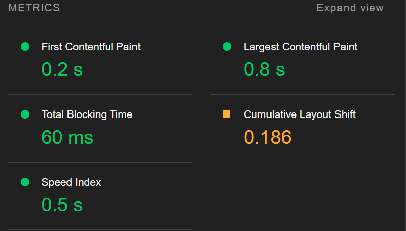

# Frontend Task - SQL Query (React/TypeScript)

## Deployment
You can view the deployed version here: [https://react-sql-editor-gilt.vercel.app](https://react-sql-editor-gilt.vercel.app/)

### How to use
1. Visit the deployed site (or clone locally and run `npm run dev`)

## Prompt
> Create, design and implement a web-based application capable of running SQL queries and displaying the results of said query. The application must include a space which accepts SQL queries in the form of user inputs, then runs the given query, and displays the result within the application

## Approach

### Ideation
- As the prompt is about fetching query data, one of the design decisions, I looked at online SQL editors as design references, as they have a similar purpose.

### Enhancements for user experience
- Users should be able to access the results of any queries they have run.
- Users can see the recently used queries on the left panel

### Features
- Queries are listed on the left side
- The SQL query is a textarea, with validation to ensure you enter some text when you click "Run Query"
- Material UI table has been used for the loading of the query data
- The queries run are mocked, with a random probability of the mock response erroring out. This is intentional for testing purposes.
- User can download the CSV format of the output table

## Performance & Optimization
- I chose a minimal set of dependencies to keep the bundle size as low as possible.
- Heavy components have been memoized to reduce potential re-renders.
- React lazy has been used to improve the load time

## Dependencies
- This project is built with **React** & TypeScript

The following libraries are used:
- **SCSS** for the styling.
- **usestate** for state management.
- **Material UI Table** for table rendering.

## Performance screenshots

